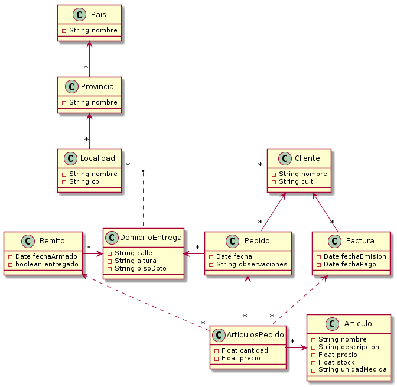

### Laboratorio de Programación y lenguajes

### Trabajo Práctico

# Delivery

### Pedido, entrega y facturación de Artículos.

## Instalación y configuración del entorno de desarrollo

ESTE LABORATORIO ESTÁ PREPARADO Y PROBADO PARA SER DESARROLLADO SOBRE SISTEMAS **LINUX**, ES REQUERIMIENTO DE LA ASIGNATURA FAMILIARIZARSE CON EL MISMO.

Quien no cuente con el mismo en sus máquinas la cátedra sugiere dos posibles aproximaciones:

1.  (Recomendada) Instalar cualquier distro Linux dual-boot.
2.  Instalar el sistema en una máquina virtual

En la raíz de este directorio existe el script ´lpl´ para facilitar la ejecución de varios comandos. En el presente instructivo se indicará en cada paso, si corresponde, la opción de ejecución mediante este script.

## Setup

### Software necesario previamente

1. Instalar [Git](https://git-scm.com/download/linux)

1. Instalar [Docker](https://docs.docker.com/install/linux/docker-ce/ubuntu/) y [Docker Compose](https://docs.docker.com/compose/install/)

   **¡CONFIGURACIÓN IMPORTANTE ANTES DE CONTINUAR!**

   1. No olvidar los instructivos de post instalación para ejecutar docker sin priviliegios de `root`.
   1. Crear el archivo `/etc/docker/daemon.json` con el siguiente conenido:
      ```json
      {
        "userns-remap": "TU_NOMBRE_DE_USUARIO"
      }
      ```
   1. Editar los archivos `/etc/subuid` y `/etc/subgid`. Agregar la línea:
      ```
      TU_NOMBRE_DE_USUARIO:1000:65536
      ```

1. Iniciar servicio docker `sudo systemctl start docker`

   Este comando puede variar según la distro de linux utilizada.

1. Instalar [Postman](https://www.postman.com/downloads/) y [DBeaver](https://dbeaver.io/download/)

1. Instalar un editor de texto para escribir el código, se recomienda [VS Code](https://code.visualstudio.com/download).

### Configuración de usuario de Gitlab

1. Genera una clave pública y agregarla al repo desde settings/ssh keys en Gitlab. Seguir este [instructivo](https://git.fi.mdn.unp.edu.ar/help/ssh/README#generating-a-new-ssh-key-pair)

### Obtener el código para trabajar

1. Realizar el **Fork** y dirigirse al repositorio nuevo.

1. Desde la línea de comandos, clonar este repositorio con la url ssh.

   ```sh
   git clone ssh://git@git.fi.mdn.unp.edu.ar:30000/<repo>`
   ```

1. Ir al directorio clonado `cd <repo_dir>`

1. Dar permisos de ejecución al script `lpl`: `chmod +x lpl`.

1. Hacer el build de las imágenes Docker `./lpl build`

1. Levantar los servidores `./lpl up`

   Este paso toma un tiempo debido a que debe descargar las dependencias del proyecto. Para monitorear el progreso utilizar `./lpl logs`.

   Cuando la aplicación esté lista se verá el mensaje:

   `backend | [...] Started BackendApplication in xxx seconds`

1. Verificar funcionamiento ingresando a http://localhost:8080/ . Si todo funciona correctamente debería responder el siguiente JSON:
   ```json
   {
     "data": "Hello Labprog!",
     "message": "Server Online",
     "status": 200
   }
   ```
1. Crear el proyecto Angular en el front:

   ```sh
   $ ./lpl sh front
   [frontend]$ ng new cli --minimal -S -g --defaults
   ```

1. Descomentar linea indicadas en `docker-compose.yml`.

1. Verificar funcionamiento ingresando a http://localhost:4200/ .

Aquí finaliza la instalación y configuración del ambiente de desarrollo, a continuación se detallan los pasos para comenzar con el desarrollo.

## Desarrollar con Docker

Para los siguientes pasos asegurarse de que el servicio de Docker esté corriendo, se puede ejecutar el comando `docker ps`.

El script `lpl` en la raíz del repositorio tiene una serie de comandos útiles abreviados para asistir en el proceso de desarrollo.

### Conectarse a los servidores por línea de comandos

Para conectarse al servidor **backend**, una vez corriendo los servicios, ejecutar: `./lpl sh backend`

De la misma forma es posible conectarse a cualquiera de los contenedores solo indicando el nombre del mismo.

### Detener los servicios

Para detener los servicios configurados en el archivo de docker-compose ejecutar: `./lpl down`

El siguiente comando es para detener por completo el servicio de docker. En este caso, si los servicios están corriendo se detendrán y cuando docker sea iniciado nuevamente, estos contenedores serán levantados de forma automática.

`sudo systemctl stop docker`

## Desarrollar en Java en el backend

El servidor de backend despliga automáticamente el código compilado. Luego de modificar los archivos locales se debe ejecutar el siguiente comando:

1. `./lpl compile`

Esto compilará el código en el servidor. Si no hay errores de compilación se desplegará al instante.

En ciertas ocaciones, debido a algún error de compilación que haya sido corregido, es posible que el backend no vuelva a desplegar la aplicación. En este caso, sólo es necesario reiniciar el backend.

1. `./lpl restart backend`

## Staging de datos

> PENDIENTE

## Stack tecnológico

Además de cumplir con los requerimientos funcionales planteados en cada TP, el desarrollo de la aplicación deberá garantizar las siguientes premisas:

- Usar JPA como método de persistencia del modelo de datos. Para las consultas a la base de datos se deberá utilizar JPQL.
- Diseñar la aplicación utilizando los principios de los patrones de Separación en capas &rarr; Layered y N-Tiers.
- La aplicación deberá garantizar transacciones ACID. Especialmente para los procesos.
- Siempre que se pueda y deba, garantizar los principios SOLID de la programación Orientada a Objetos. (SRP, OCP, LSP, ISP, DIP).
- El stack tecnológico requerido para la solución contempla el uso de:
  - **Git** para el control de versiones y distribución del código.
  - **Docker** para la administración de la virtualización en contenedores de los servidores.
  - **Docker compose** pra la coordinación de multiples contenedores.
  - **Angular** para el desarrollo de la aplicación frontend en javascript.
  - **Spring Boot** para el desarrollo de la aplicación backend en java.
  - **JPA** como ORM para la implementación del modelo.
  - **Postgres** cómo motor de base de datos.
  - **Cucumber-js** para el testing de los servicios REST.
- La gestión de tablas se realizará exclusivamente desde el modelo provisto a continuación y generado desde el ORM. **No se permite ingeniería inversa desde la DB.**

## Forma de entrega

- El trabajo será realizado en forma individual. Se podrá trabajar colaborativamente con otros compañeros.
- El trabajo práctico deberá ser entregado de la siguiente forma:
  - Todo el sitema completo debe ser entrega mediante el proyecto en Git.
  - Bitacora del desarrollo que incluya: Toma de decisiones de la arquitectura de la solución, restricciones de uso y relato del detalle de la evolución del desarrollo. En formato Wiki o Markdown. Este informe debería ser evolutivo en el transcurso del desarrollo del TP.
  - Toda la bibliografía utilizada deberá ser referenciada indicando título y autor, en una sección dedicada a tal efecto.
  - El diseño con el que se aborda la solución al problema planteado. En el caso de utilizar patrones, cuales de ellos utilizó y en qué contexto.
  - El programa de aplicación que implementa la solución mediante el cumplimiento efectivo de los test planteados en las features de BDD.
  - El código fuente debe estar sincronizado en git todo el tiempo para que la cátedra acceda al mismo y pueda verificar permanenetente los avances.

## Forma de aprobación

Se tendrá en cuenta para la aprobación del trabajo práctico y los integrantes del grupo:

1. Planificación del desarrollo de la aplicación. Cumplimiento de las etapas previstas.
2. Funcionamiento de la aplicación desarrollada. Se evaluará si la funcionalidad cumple con lo solicitado, en función de test de Criterios de Aceptación escritos en las features BDD.
3. Estructura general de la presentación, su legibilidad y facilidad de lectura y comprensión.
4. Contenido del informe y el uso de la información técnica para elaborarlo.

---

## Problema planteado

La empresa de logística “Lo llevamos a tu casa” se dedica a recibir pedidos telefónicos de sus clientes (que deben estar previamente registrados) para luego entregar los artículos solicitados en las locaciones indicadas por los mismos.
Una vez que se recepcionan los productos, la empresa procede a la facturación de los mismos.

## Objetivo de solución

Desarrollar una aplicación basada en el modelo de datos adjunto donde:
Cada pedido de artículos para el cliente, indica una sola localización de entrega.
Si se requieren varias localizaciones de entrega se deben confeccionar varios pedidos.
También pueden existir múltiples pedidos para el mismo cliente y la misma localización.
Los pedidos se valorizan para referencia del cliente y aunque no haya stock (existencia) de un artículo, el mismo mantiene el precio indicado al cliente.
El pedido se realiza independientemente de la existencia de stock o no del mismo.
Los remitos para entregar la mercadería se confeccionan automáticamente en función de los artículos pedidos y el stock (existencia) de los mismos.
Las Cantidades solicitadas siempre se entregan completas, no admitiendo entregas parciales.
Se deberá confeccionar un remito para cada locación del cliente indicada.
Una vez que a los artículos de un remito se les confirma su recepción por parte de los destinatarios.
Se procede a procesar (automáticamente) la confección de la factura, valorizando la misma.

## La solución requiere

### ABMC (Altas, bajas, modificaciones y consultas) de las siguientes entidades.

- Países, provincias y localidades
- Clientes y domicilios de entrega.
- Artículos.

### Confección de nuevo pedido a un cliente existente.

Indica localización de entrega del mismo, los artículos, las cantidades solicitadas y la valorización del pedido.

### Búsqueda y Consulta de un pedido de un cliente.

Consulta del histórico de artículos pedidos de un cliente, indicando si el mismo fue entregado y facturado y en qué fechas.
Del listado se deberá poder visualizar todo el pedido a partir de un artículo.

### Proceso de confección de remitos.

En base a todos los artículos pedidos y que no hayan sido procesados se deben confeccionar remitos por cliente y locación de entrega con todos los artículos que se puedan entregar en función del stock (existencia) del mismo.
En caso de no poder entregar todo el material, dicho artículo no será incluido en el remito.
Cada asignación de artículos a un pedido, deberá garantizar la actualización del stock (existencia) remanente.

### Búsqueda y Consulta de remitos de un cliente.

Se deberá poder navegar a los pedidos que lo conforman.
Deberá estar ordenada por fecha de armado (fecha de confección) de forma descendente.
Se deberá poder filtrar la lista de remitos por su estado, entregados o no (pendiente de recepción).

### Verificación de artículos entregados.

Se deberá poder consultar todos los artículos no confirmados (en la recepción), independientemente del remito o cliente (ordenados por localización de entrega) y poder verificar (chequear) que el mismo fue entregado (proceso de confirmación de entrega: manual).

### Proceso de confección de facturas (automático).

Para todos los artículos recepcionados y que no hayan sido facturados, de deberá emitir una factura por cada cliente (independientemente de su domicilio de entrega).

### Búsqueda y Consulta de facturas de un cliente.

Se deberá poder navegar a los remitos que la conforman. Deberá estar ordenada por fecha de emisión (fecha de confección) de forma descendente.
Se deberá poder filtrar la lista de facturas por si fueron pagadas o no (pendiente de pago).

### Verificación de facturas pagadas.

Se deberá poder consultar todas las facturas que no han sido pagadas aún y poder verificar (chequear) que la misma se abonó y en que fecha (básicamente lo importante es la fecha de pago).

## Criterio de satisfacción

### Ejemplo de uso y validaciones

La aplicación deberá garantizar la implementación de los casos de uso descriptos anteriormente.
La verificación de calidad se realizará utilizando las siguientes premisas para un conjunto de pruebas a realizar:

- Cargar múltiples pedidos para múltiples clientes. Donde existan al menos dos localizaciones diferentes para al menos 2 de los clientes que realizan pedidos.
  Cargar al menos 2 pedidos diferentes a la misma locación para el mismo cliente.
- Los artículos cargados en los pedidos deberán garantizar:
  - Al menos un artículo que tenga stock (existencia) necesario para todos los pedidos realizados. Dicho artículo deberá estar en al menos 3 pedidos distintos.
  - Al menos un artículo que se pueda entregar parcialmente. Al menos 2 remitos que se puedan conformar y al menos dos que no.
  - Corolario de lo anterior será comprobar que si bien en el proceso de conformación de remito no hay existencia para el remito que se está procesando, se pueda asignar stock para algún remito siguiente a conformar en el mismo proceso.
    Por ejemplo:
    1. _Artículo A_ posé un stock de 10 unidades al comenzar el proceso.
    1. _Remito 1_ para el _Cliente X_ solicita 6 unidades del artículo, se le asignan y por lo tanto queda un stock de 4 unidades para el _Artículo A_.
    1. _Remito 2_ para el _Cliente Y_ solicita 7 unidades del _Artículo A_ y por lo tanto, por falta de existencia no se le agrega el artículo al remito.
    1. _Remito 3_ del _Cliente Z_ solicita 3 unidades del _Artículo A_ y por lo tanto como el stock es de 4 unidades, se le asignan las 3 solicitadas y se conforma el artículo en el remito, quedando 1 unidad de stock para el artículo.
  - La confección de facturas deberá contar con al menos 2 remitos no entregados.
  - Todos los reportes solicitados deberán mostrar todas las opciones de combinaciones posibles.

Todos los casos de criterios de satisfacción deberán estar correctamente documentados y deberán poder ser replicado y repetidos pasos a paso en la devolución a realizar con el docente.

La presentación de defensa con el docente deberá ser una presentación de la solución, donde el alumno demuestre paso a paso todos los casos de prueba y criterios de satisfacción solicitados.


